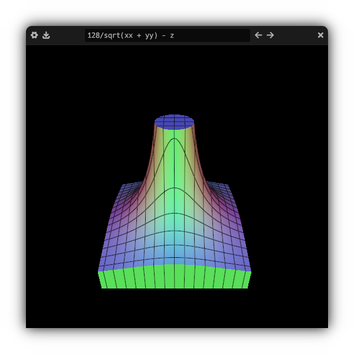

# Function Renderer
This is an implementation of the dual contouring algorithm in Vulkan compute shaders. It includes an Egui graphical interface for editing and viewing the function. It can also export .stl files.


# Building
You need somewhat recent graphics drivers, shaderc, Rust, and a C++ compiler
## Archlinux
```sh
sudo pacman -S shaderc rust gcc
git clone https://github.com/mihavlic/function-renderer.git
cd function-renderer
cargo run
```

## Windows
install the [Lunarg SDK](https://vulkan.lunarg.com/), [Rust](https://www.rust-lang.org/tools/install), and get MSVC from the [Windows SDK](https://developer.microsoft.com/en-us/windows/downloads/windows-sdk/)
```sh
git clone https://github.com/mihavlic/function-renderer.git
cd function-renderer
cargo run
```